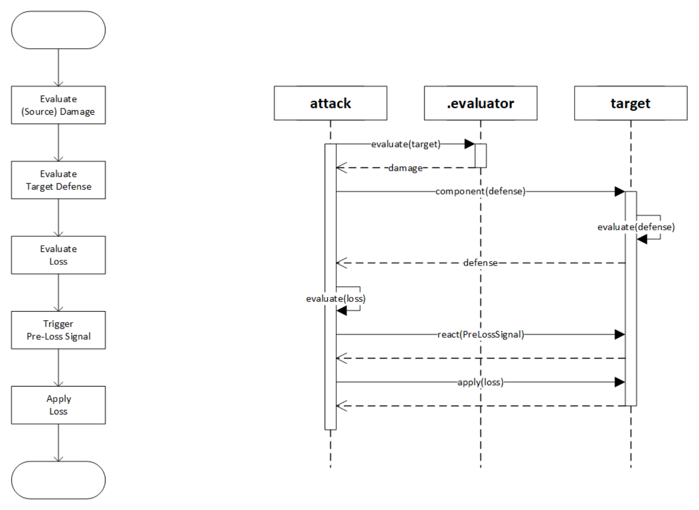

# Reactor

`Reactor`（响应器）是指任何可以对信号（Signal）产生响应的程序片段。
*响应* 是系统的主要行为方式，既包含（产生）动作，也包含数值评估（buff / evaluation）。

# Current

在处理（响应）信号时，由于响应器并没有保持角色的引用，
系统会向处理程序注入 `Current` 对象，即当前角色，
通常也就是附加了该响应器片段的角色。
也有响应器并没有附加到任何角色，而是作为战场效果生效，
这时 `Current` 是一个空对象。

# Action (Conceptual)

* `id` per run unique id
* `signal` 触发该动作的信号
* `source` warrior who initiates the action if available
* `reactor` reactor which initiates the action, an active skill or passive buff or so
* `targets` (selected) targets
* `false_targets` targets somehow become false (typically died) after being selected
* `immune_targets` targets which immune to action, for an `ImmuneActor` to set
* `loss` damage points, 技能（已经执行的动作，该回合）造成的伤害
* `critical` 暴击标志，仅 `attack` 动作有效

# Verb

* `attack` 攻击，造成伤害
* `heal` 治疗
* `buff` 向角色增加响应器
* `purge` 从角色移除响应器

# Axis

* `damage` 攻击力
* `defense` 防御力
* `speed` 速度
* `position` 位置（序号）
* `critical_odds` 暴击几率
* `critical_loss` 暴击伤害（%）
* `health` （当前）生命值
* `health_maximum` 最大生命值
* `health_percent`
* `loss` 伤害

# Attack

# Actors

| Evaluation    | Script      | Action          | PreLoss        | Combo              |
|---------------|-------------|-----------------|----------------|--------------------|
| `Buffer`      | `VerbActor` | `ActionBuffer`  | `LossResister` | `SelectActor`      |
| `TheoryActor` |             | `CriticalActor` | `LossStopper`  | `ProbabilityActor` |
|               |             | `ImmuneActor`   |                | `SequenceActor`    |
|               |             |                 |                | `RepeatActor`      |

<table>
<thead>
  <tr>
    <th>Actor</th>
    <th>Synopsis</th>
    <th>Parameters</th>
  </tr>
</thead>

<tbody>
  <tr>
    <th>Buffer</th>
    <td>数值增益</td>
    <td>
      <ul>
        <li><code>axis</code></li>
        <li>
          <code>bias</code>
          将 evaluator 数值作为百分比，按照乘法（<code>false</code>）或者
          作为绝对值，按照加法（<code>true</code>）修正
        <li><code>evaluator</code></li>
      </ul>
    </td>
  </tr>

  <tr>
    <th>TheoryActor</th>
    <td>附加在（攻击）动作上，按发起者和目标的标签（Tag）的调整伤害（评估）</td>
    <td>
      <ul>
        <li><code>theory: Array<(s, t, v)></code> 发起者，目标和数值的数组；发起者和目标都以标签进行匹配</li>
      </ul>
    </td>
  </tr>

  <tr>
    <th>VerbActor</th>
    <td>执行动作</td>
    <td>
      <ul>
        <li><code>verb</code></li>
        <li>
          <code>evaluator</code>
          可选，如果设置将绑定发起者进行评估，并覆盖 <code>verb.evaluator</code>
        </li>
      </ul>
    </td>
  </tr>

  <tr>
    <th>ActionBuffer</th>
    <td>动作增益，主要用于调整伤害</td>
    <td>
      <ul>
        <li>
          <code>evaluator</code>
          可选，如果设置将覆盖 <code>buffer.evaluator</code>
        </li>
      </ul>
    </td>
  </tr>

  <tr>
    <th>CriticalActor</th>
    <td>将动作标记为<em>暴击</em></td>
    <td></td>
  </tr>

  <tr>
    <th>ImmuneActor</th>
    <td>将对象标记为（对该动作）<em>免疫</em></td>
    <td></td>
  </tr>
  
  <tr>
    <th>LossResister</th>
    <td>消耗<code>capacity</code>，降低相等数值的伤害</td>
    <td></td>
  </tr>

  <tr>
    <th>LossStopper</th>
    <td>将伤害降低到指定值</td>
    <td>
      <ul>
        <li><code>full</code> 完全抵御伤害</li>
        <li><code>evaluator</code> 伤害数值的上限</li>
      </ul>
    </td>
  </tr>
  
  <tr>
    <th>SelectActor</th>
    <td>对选定的目标执行动作</td>
    <td></td>
  </tr>
  
  <tr>
    <th>ProbabilityActor</th>
    <td>以一定的几率执行动作</td>
    <td>
      <ul>
        <li><code>evaluator</code> 几率，%</li>
      </ul>
    </td>
  </tr>
  
  <tr>
    <th>SequenceActor</th>
    <td>将一系列动作组合成一个动作</td>
    <td></td>
  </tr>
  
  <tr>
    <th>RepeatActor</th>
    <td>重复执行动作</td>
    <td>
      <ul>
        <li><code>count</code> 重复执行的次数</li>
      </ul>
    </td>
  </tr>
</tbody>
</table>

# Evaluators

| Warrior          | EvaluationContext | ActionContext   |                   | Combo        |
|------------------|-------------------|-----------------|-------------------|--------------|
| `ConstEvaluator` | `SelectCounter`   | `LossEvaluator` | `CustomEvaluator` | `Adder`      |
| `AxisEvaluator`  |                   |                 |                   | `Multiplier` |
| `BuffCounter`    |                   |                 |                   |              |

| Evaluator       | Synopsis               |
|-----------------|------------------------|
| ConstEvaluator  | 常量                     |
| AxisEvaluator   | 获取角色（或动作）的数值属性         |
| BuffCounter     | 统计该角色匹配指定标签的增益数量       |
| SelectCounter   | 统计选中的角色数量              |
| LossEvaluator   | 获取技能（已经执行的动作，该回合）造成的伤害 |
| CustomEvaluator | Internal use only      |
| Adder           | 加法                     |
| Multiplier      | 乘法                     |

# Selectors

| Side                      | Signal            | ActionSignal     | Filter               | Combo              |
|---------------------------|-------------------|------------------|----------------------|--------------------|
| `AbsoluteSideSelector`    | `CurrentSelector` | `SourceSelector` | `SortSelector`       | `PipelineSelector` |
| `SideSelector`            |                   |                  | `SuffleSelector`     |                    |
| `CounterPositionSelector` |                   |                  | `FrontSelector`      |                    |
|                           |                   |                  | `WaterLevelSelector` |                    |

<table>
<thead>
  <tr>
    <th>Selector</th>
    <th>Synopsis</th>
    <th>Parameters</th>
  </tr>
</thead>

<tbody>
  <tr>
    <th>AbsoluteSideSelector</th>
    <td>选择队伍</td>
    <td>
      <ul>
        <li><code>side: Left | Right</code></li>
      </ul>
    </td>
  </tr>

  <tr>
    <th>SideSelector</th>
    <td>选择敌我</td>
    <td>
      <ul>
        <li><code>side</code> 敌方（<code>false</code>）或己方（<code>true</code>）</li>
      </ul>
    </td>
  </tr>

  <tr>
    <th>CounterPositionSelector</th>
    <td>选择对方相同（或临近）位置的角色</td>
    <td>
      <ul>
        <li><code>r</code> 半径，<code>position</code> 距离</li>
      </ul>
    </td>
  </tr>

  <tr>
    <th>CurrentSelector</th>
    <td>选择当前对象</td>
    <td></td>
  </tr>

  <tr>
    <th>SourceSelector</th>
    <td>选择动作的发起者</td>
    <td></td>
  </tr>

  <tr>
    <th>SortSelector</th>
    <td>对列表中的角色排序</td>
    <td>
      <ul>
        <li><code>axis</code> 用于排序的属性</li>
        <li><code>asc</code> 降序（<code>false</code>）或升序（<code>true</code>）</li>
      </ul>
    </td>
  </tr>

  <tr>
    <th>ShuffleSelector</th>
    <td>在将匹配 <code>preference</code> 标签的角色置前的同时，对列表中的角色随机排序</td>
    <td>
      <ul>
        <li><code>preference</code> 可选，随机排列时优先的标签</li>
      </ul>
    </td>
  </tr>

  <tr>
    <th>FrontSelector</th>
    <td>选择列表前部的角色</td>
    <td>
      <ul>
        <li><code>count</code> 选取角色的数量</li>
      </ul>
    </td>
  </tr>

  <tr>
    <th>WaterLevelSelector</th>
    <td>选择列表中符合比较运算的角色</td>
    <td>
      <ul>
        <li><code>comparator</code> 比较运算符</li>
        <li><code>evaluator</code></li>
        <li><code>value</code> 参考值</li>
      </ul>
    </td>
  </tr>

  <tr>
    <th>PipelineSelector</th>
    <td>组合多个选择器合，将前一级选中的角色做为候选依次执行各选择器</td>
    <td></td>
  </tr>
</tbody>
</table>

# Signal

| Name | Synopsis |
|-|-|
| FreeSignal | Internal use only |
| EvaluationSignal | 求值，获取数值属性 |
| PreLossSignal | 通知目标角色，即将造成伤害，用于伤害修正 |
| LaunchSignal | 通知目标行动，触发（主动）技能 |
| BattleStartSignal | 战斗开始 |
| RoundStartSignal | 回合开始 |
| RoundEndSignal | 回合结束 |
| PreActionSignal | 即将执行动作，可以修正动作（目标），也可能触发新的动作 |
| PostActionSignal | 动作结束，可能触发新的动作 |
| LifecycleSignal | 生命周期信号，通知 |

# Triggers

| Signal          | Action                   | Verb                    | Combo        |
|-----------------|--------------------------|-------------------------|--------------|
| `SignalTrigger` | `CurrentIsSourceTrigger` | `VerbTrigger`           | `AnyTrigger` |
|                 | `CurrentIsTargetTrigger` | `CriticalStrikeTrigger` | `FatTrigger` |
|                 | `ReactorTrigger`         | `TagTrigger`            |              |

| Trigger                | Synopsis                                |
|------------------------|-----------------------------------------|
| SignalTrigger          | 匹配指定信号                                  |
| CurrentIsSourceTrigger | 当前对象是动作的发起者                             |
| CurrentIsTargetTrigger | 当前对象是动作的目标（之一）                          |
| ReactorTrigger         | 发起当前动作的响应器匹配指定标签                        |
| VerbTrigger            | 当前动作匹配指定动词                              |
| CriticalStrikeTrigger  | 当前的动作是暴击                                |
| TagTrigger             | 当前动作（给目标）附加的增益匹配标签                      |
| AnyTrigger             | 组合多个触发器，任何一个触发时即视作触发                    |
| FatTrigger             | 当信号（signal）携带动作时，使用（一系列）动作触发器，进一步判定是否触发 |

# Tags

| Name             | Underlying |          |
|------------------|------------|----------|
| -                | `string`   |          |
| `Label`          | `string`   |          |
| `Priority`       | `int`      |          |
| `ExclusionGroup` | `uint8`    |          |
| `StackingLimit`  | `int`      | capacity |
